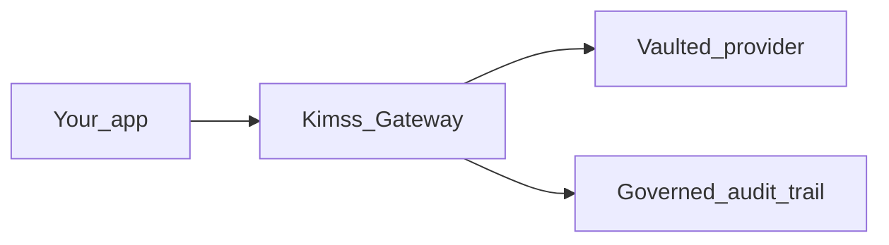

# Kimss Java — Secure AI Gateway

[](https://central.sonatype.com/artifact/ai.kimss/kimss-java)
[](LICENSE)
[](https://github.com/kimss-ai/kimss-java-sdk/actions/workflows/ci.yml)

> **Deprecated for new gateway onboarding.** Do not add Maven `com.kimss:kimss-java` to connect a service. Use the official OpenAI or Anthropic Java client (or JDK `HttpClient`) and follow the [control-plane agent-to-agent contract](https://github.com/kimss-ai/kimss-control-plane/blob/main/AI_INTEGRATION.md). New Python agents: [Kimss Forge](https://github.com/kimss-ai/kimss-forge).

**Track, govern, and secure autonomous agents with exactly 1 line of code. Zero data-plane refactoring required.**

Dual-listener inbound: OpenAI OkHttp at `https://api.kimss.ai/v1` or Anthropic Java client at `https://api.kimss.ai` + Agent-Id headers.

[Kimss](https://kimss.ai) is a **Model-Agnostic Enterprise AI Gateway** and **Governance Control Plane**. Point the official OpenAI or Anthropic Java client at Kimss, add Agent ID headers, and every call is identified, audited, and kill-switchable — without rewriting your service. Kimss never hosts your models (**BYOI**).

> **AI coding assistants:** read the canonical [control-plane `AI_INTEGRATION.md`](https://github.com/kimss-ai/kimss-control-plane/blob/main/AI_INTEGRATION.md) first (local mirror: [AI_INTEGRATION.md](AI_INTEGRATION.md)).

**OpenAI**

```java
OpenAIClient client = OpenAIOkHttpClient.builder()
    .baseUrl("https://api.kimss.ai/v1")
    .apiKey(System.getenv("KIMSS_WORKSPACE_KEY"))
    .putHeader("X-Kimss-Agent-Id", System.getenv("KIMSS_AGENT_ID"))
    .putHeader("X-Kimss-Agent-Name", System.getenv().getOrDefault("KIMSS_AGENT_NAME", "My Agent"))
    .build();
```

**Anthropic**

```java
AnthropicClient client = AnthropicOkHttpClient.builder()
    .baseUrl("https://api.kimss.ai")
    .apiKey(System.getenv("KIMSS_WORKSPACE_KEY"))
    .putHeader("X-Kimss-Agent-Id", System.getenv("KIMSS_AGENT_ID"))
    .putHeader("X-Kimss-Agent-Name", System.getenv().getOrDefault("KIMSS_AGENT_NAME", "My Agent"))
    .build();
```

**Developer tier (Always Free):** 25,000 governed requests/month · [Get a key](https://kimss.ai/app/signup)

| Inbound | Vaulted BYO |
|---------|-------------|
| OpenAI Java → `https://api.kimss.ai/v1` + `X-Kimss-Agent-Id` | OpenAI, Azure AI Foundry, Anthropic, DeepSeek, vLLM |
| Anthropic Java → `https://api.kimss.ai` (`/v1/messages`) | Internal MCP servers (Control Plane registration) |



---

## 3-step setup

### 1. Sign In & Vault

Log into [Kimss AI](https://kimss.ai/app/signup). Vault your provider endpoint under **Governance → Provider Vault** (Connected Infrastructure). Optional **monthly token caps** per endpoint guard provider spend — [docs](https://kimss.ai/docs/custom_model_endpoints).

### 2. Mint Key

**Gateway → Generate Key**. Copy `kimss_...` once.

### 3. Route Traffic (zero refactoring)

Point OpenAI at `https://api.kimss.ai/v1` or Anthropic at `https://api.kimss.ai`, pass the workspace key, inject `X-Kimss-Agent-Id` / `X-Kimss-Agent-Name`.

More detail: [GETTING_STARTED.md](GETTING_STARTED.md).

---

## Control plane (DevOps)

The `ai.kimss:kimss-java` artifact is **not** the inference path. Use REST + Governance UI:

| Concern | How |
|---------|-----|
| Kill switch | UI or `POST /agent_set_status/` |
| Audit | Gateway Recent calls; `POST /audit_log/` |
| MCP sync | Control Plane registration UI |
| Register agent | `POST /v1/agents/register` with `X-Kimss-Key` |
| Vault endpoint + token cap | `POST/PATCH /api/v1/custom-model-endpoints` — [docs](https://kimss.ai/docs/custom_model_endpoints) |

`KimssClient.agents().run` and `models().create` are **`@Deprecated`**.

---

## Installation (optional legacy client)

### Maven

```xml
<dependency>
  <groupId>ai.kimss</groupId>
  <artifactId>kimss-java</artifactId>
  <version>0.2.0</version>
</dependency>
```

### Gradle

```kotlin
implementation("ai.kimss:kimss-java:0.2.0")
```

Requirements: JDK **11+**. Example: [examples/GatewayProxyFirstCall.java](examples/GatewayProxyFirstCall.java).

## License

MIT — see [LICENSE](LICENSE).
